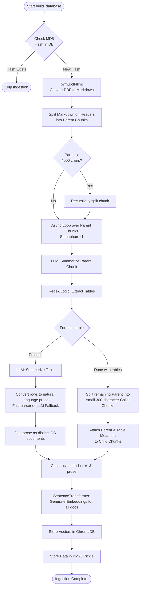

# D&D RAG Database Build Lifecycle (`build_rag_db.py`)

This file explains how the raw `DandDRuleset.pdf` is transformed, processed, and stored into a searchable RAG (Retrieval-Augmented Generation) database for the AI agents to consume.

## High-Level Execution Flow

At its core, `build_rag_db.py` relies on a Hierarchical Chunking approach. Instead of simply hacking the PDF into uniform blocks of text (which loses context), it breaks the document into logical sections (Parents), creates rich context and metadata for those sections via local LLMs (`phi4`), and finally chops them into embeddable bits (Children).

### Process Step-by-Step

1. **Initialization & Cache Check**: Starts by hashing the `DandDRuleset.pdf`. If that hash is already fully ingested in the Chroma database, it terminates early to save time.
2. **Markdown Extraction (`pymupdf4llm`)**: Converts the visual PDF directly into markdown text format.
3. **Parent Chunking (`MarkdownHeaderTextSplitter`)**: 
   - Breaks the markdown document down using Headers (`#`, `##`, `###`).
   - If one of these sections exceeds 4000 characters, it falls back to a standard recursive split to cap the size.
   - These are our "Parent Chunks" (logical sections of the rulebook).
4. **Concurrent LLM Enrichment (`process_parent_chunk_async`)**:
   - **Semaphore Control**: Uses `asyncio.Semaphore(1)` to ensure only *one* `phi4` agent processes data at any time, preventing resource thrashing.
   - **Parent Summary**: Asks the LLM to generate a 1-sentence descriptive title and summary for the Parent Chunk.
   - **Table Extraction & Prose**: Finds markdown tables (and poorly formatted "ghost" tables). For each table:
     - Asks the LLM to write a 1-sentence summary of what the table represents.
     - Automatically parses the data rows into natural language (e.g., instead of an unreadable grid, it generates: *"the weapon is Longsword, the damage is 1d8 slashing..."*). If standard parsing fails, it asks the LLM to create the prose.
   - **Child Chunking**: Splits the Parent Chunk's remaining text into tiny 300-character "Child Chunks".
   - **Metadata Attachment**: Tags every Child Chunk and Table Prose with the Parent's title, summary, ID, and hash, guaranteeing no chunk loses semantic context.
5. **Vector Embedding**: 
   - Loads the `BAAI/bge-large-en-v1.5` encoder model.
   - Converts all the small child text chunks and the table prose sentences into dense numerical vectors.
6. **Storage**:
   - Saves the vectors and metadata into **ChromaDB**.
   - Pickles the raw text, metadata, and IDs into a `bm25_corpus.pkl` file so the agents can also do traditional exact-keyword matching (BM25) as a retrieval fallback.

---

## Visual Model (Mermaid Diagram)

Below is a visual flowchart representing the chunking and embedding process:

