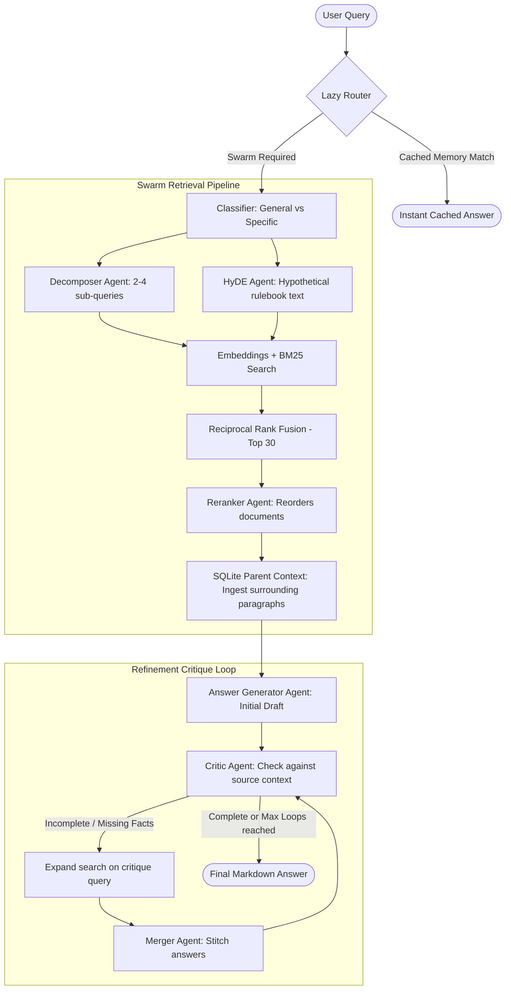
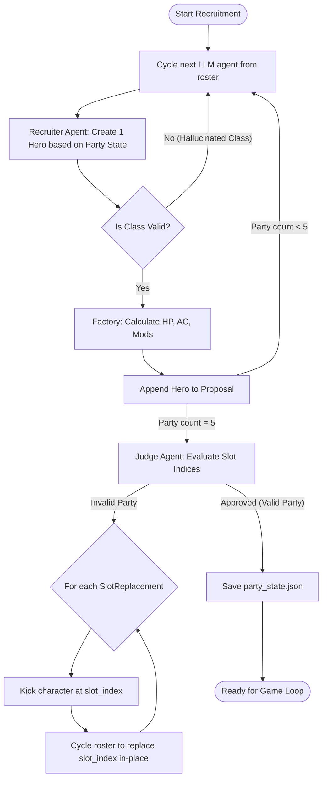

# D&D Capstone: Agent Swarm Architecture & Pseudocode

This document details the multi-agent swarm architecture driving the D&D Capstone project. It covers the core building blocks (`core_agent.py`), the RAG multi-agent query pipeline (`core_rag_pipeline.py`), and the character recruitment agentic game-state builder (`recruiter.py` & `factory.py`).

---

## 1. Core Agent Module (`core_agent.py`)

The foundational block of the entire architecture is the `CoreAgent` class. Rather than relying on heavy agent frameworks, this class wraps `litellm` directly with state-management, metrics tracking, and schema validation.

### Design Elements
*   **Persona Isolation:** Each agent is initialized with a distinct `agent_id` and `system_prompt`.
*   **Structured Outputs:** Uses Pydantic models to enforce JSON outputs. If the model natively supports structured outputs (e.g., standard models), the schema is passed via `response_format`. If not (e.g., DeepSeek models that require space for `<think>` blocks), it injects the schema instructions into the prompt and parses it manually.
*   **Auto-Correction / Retry Loop:** If the LLM generates invalid JSON or fails Pydantic schema validation, the agent catches the error, appends the failure output and a correction prompt to the context, disables native structured output (as a fallback), and retries up to `max_retries` times.
*   **Working Memory (L1):** A short-term conversation list capped at the last 20 messages (sliding window) to prevent context bloat. If `one_shot` is `True`, memory is purged immediately after the response is generated.
*   **Metrics Engine:** Tracks cumulative token usage, API cost, and elapsed execution time.

### CoreAgent Pseudocode

```python
class CoreAgent:
    def __init__(agent_id, system_prompt, litellm_kwargs, one_shot=True, response_model=AgentResponse):
        self.agent_id = agent_id
        self.system_prompt = system_prompt
        self.litellm_kwargs = litellm_kwargs.copy()
        self.one_shot = one_shot
        self.response_model = response_model
        self.working_memory = [] # short-term context (L1 memory)
        self.tokens_used = 0
        self.cost = 0.0
        self.total_response_time = 0.0

    async def ask(user_input, response_model=None, max_retries=3):
        active_model = response_model or self.response_model
        
        # 1. Prune sliding window to keep last 20 messages
        if len(self.working_memory) >= 20:
            self.working_memory = self.working_memory[-20:]
            
        self.working_memory.append({"role": "user", "content": user_input})
        
        # Assemble payload
        dynamic_prompt = self.system_prompt
        payload = [{"role": "system", "content": dynamic_prompt}] + self.working_memory
        
        base_generate_kwargs = self.litellm_kwargs.copy()
        
        # 2. Configure structured outputs or fallback prompts
        if active_model:
            model_name = base_generate_kwargs.get("model", "").lower()
            if "deepseek" in model_name:
                # Prompt-injected structured schema (free-form thinking allowed)
                schema_str = json_serialize(active_model.schema())
                dynamic_prompt += f"\n\nYou MUST output valid JSON conforming to this schema:\n{schema_str}"
                payload[0]["content"] = dynamic_prompt
            else:
                # Native Structured Output enforcement
                base_generate_kwargs["response_format"] = active_model

        current_messages = payload.copy()

        # 3. Execution & Auto-correction Loop
        for attempt in range(max_retries):
            generate_kwargs = base_generate_kwargs.copy()
            generate_kwargs["messages"] = current_messages
            
            start_time = now()
            response = await litellm.acompletion(**generate_kwargs)
            self.total_response_time += (now() - start_time)
            
            # Accumulate metrics
            self.tokens_used += response.usage.total_tokens
            self.cost += calculate_cost(response)
            
            raw_output = response.choices[0].message.content
            
            if active_model:
                try:
                    # Clean markdown wrappers (like ```json ... ```)
                    cleaned_output = clean_json_markers(raw_output)
                    # Validate JSON structure against Pydantic schema
                    parsed_output = active_model.validate_json(cleaned_output)
                    
                    self.working_memory.append({"role": "assistant", "content": raw_output})
                    if self.one_shot:
                        self.working_memory.clear()
                    return parsed_output
                except Exception as error:
                    if attempt == max_retries - 1:
                        raise error # Fail out after max attempts
                    
                    # Feed the error back to the model for self-correction
                    current_messages.append({"role": "assistant", "content": raw_output})
                    if "response_format" in base_generate_kwargs:
                        # Fallback: disable strict mode and switch to text-injection model
                        del base_generate_kwargs["response_format"]
                        schema_str = json_serialize(active_model.schema())
                        current_messages.append({"role": "user", "content": f"JSON failed. Error: {error}. Return valid JSON under schema:\n{schema_str}"})
                    else:
                        current_messages.append({"role": "user", "content": f"JSON failed. Error: {error}. Please correct the output structure."})
            else:
                # Unstructured output fallback
                self.working_memory.append({"role": "assistant", "content": raw_output})
                if self.one_shot:
                    self.working_memory.clear()
                return raw_output
```

---

## 2. Multi-Agent RAG System (`core_rag_pipeline.py`)

To answer complex questions from the D&D Rulebooks, the Capstone implements a sophisticated multi-agent retrieval, reranking, and self-critique architecture.



### The Specialist Agents
1.  **Lazy Router (`lazy_router`):** Examines conversation memory. If the question is answered in recent logs, it bypasses database calls. If not, it rewrites the query to include implicit context (e.g. converting *"What is its range?"* to *"What is the range of the spell Fireball?"*).
2.  **Classifier (`classifier`):** Evaluates if the query is a broad overview (`General`) or a target statistic/rule (`Specific`). This configures the maximum iteration limits for the critique loop (8 loops for general rules, 3 for specific stats).
3.  **Decomposer (`decomposer`):** Splits complex topics into 2-4 atomic sub-queries.
4.  **HyDE Agent (`hyde_agent`):** Generates a hypothetical "official rulebook text" matching the query to improve dense embedding vector matching.
5.  **Reranker (`reranker`):** Sorts the merged vector/keyword results by contextual relevance.
6.  **Answer Generator (`answer_agent`):** Drafts a factual response restricted *only* to retrieved context.
7.  **Critic (`critic`):** Compares the output against the retrieved rules. If details are missing, it commands a search expansion with a targeted query.
8.  **Merger (`merger`):** Synthesizes supplemental research back into the master answer.

### Retrieval Stack Execution
*   **Dual-Retrieval (Hybrid):** Combines dense vector semantic matches (via ChromaDB & `BAAI/bge-large-en-v1.5` embeddings) with sparse keyword queries (via BM25 index) on the combined queries (`[original] + sub_queries + [hyde]`).
*   **Reciprocal Rank Fusion (RRF):** Scores chunks by their relative ranks in both dense and sparse retrieval sets.
*   **Reranking:** The top 30 chunks are sent to the `Reranker` agent, which outputs the top 12 indices.
*   **SQLite Parent Enrichment:** Uses the `parent_id` of the top chunks to retrieve broader surrounding context (up to 1,500 characters) from `parent_chunks.db`.

### RAG Pipeline Swarm Pseudocode

```python
async def route_query_with_history(query, chat_history):
    # Determine if query can be answered using chat history cache
    decision = await lazy_router.ask(f"History:\n{chat_history}\nQuery: {query}")
    
    if not decision.needs_swarm:
        return decision.cached_answer
        
    # Swarm required; use rewritten isolated query
    standalone_query = decision.rewritten_query or query
    return await execute_rag_swarm(standalone_query)


async def execute_rag_swarm(query):
    # 1. Classification & Loop Setup
    classification = await classifier.ask(query)
    is_general = (classification.category.lower() == "general")
    max_passes = 8 if is_general else 3

    # 2. Retrieval Pipeline
    sub_queries = (await decomposer.ask(query)).sub_queries
    hyde_text = (await hyde_agent.ask(query)).hyde_text
    
    all_queries = [query] + sub_queries + [hyde_text]
    
    # Run dense vector and BM25 queries
    vector_hits = chroma_collection.query(embeddings=embed(all_queries), n_results=20)
    bm25_hits = bm25_index.query(tokenize(all_queries), n_results=20)
    
    # Merge and rank via Reciprocal Rank Fusion (RRF)
    rrf_list = reciprocal_rank_fusion(vector_hits, bm25_hits, limit=30)
    
    # Rerank top 30 chunks down to top 12
    rerank_order = await reranker.ask(f"Rank these chunks: {rrf_list}")
    top_chunks = [rrf_list[i] for i in rerank_order.ranked_indices[:12]]
    
    # Load parent section context from SQLite to resolve truncated sentences/tables
    context_blocks = []
    for chunk in top_chunks:
        parent_content = sqlite_db.query("SELECT content FROM parent_chunks WHERE id=?", chunk.parent_id)
        context_blocks.append(f"Excerpt: {chunk.text}\nBroader Context: {parent_content}")
    
    master_context = join(context_blocks)

    # 3. Initial Drafting
    answer_prompt = f"Question: {query}\nContext: {master_context}"
    draft = (await answer_agent.ask(answer_prompt)).answer

    # 4. Critique & Refinement Loop
    current_pass = 0
    previous_follow_up = ""
    
    while current_pass < max_passes:
        # Ask Critic to audit the draft against raw context
        critique = await critic.ask(f"Q: {query}\nCtx: {master_context}\nDraft: {draft}")
        
        if critique.is_complete or not critique.follow_up_query:
            break # Fully complete!
            
        if critique.follow_up_query == previous_follow_up:
            break # Stop infinite loops if research is stall
            
        # Retrieval Expansion: retrieve new context specifically for the critic's follow-up question
        supplemental_context = await execute_retrieval_only(critique.follow_up_query)
        
        # Draft supplemental details
        new_info = (await answer_agent.ask(f"Follow-up: {critique.follow_up_query}\nCtx: {supplemental_context}")).answer
        
        # Merge supplemental info into the running draft
        merged = await merger.ask(f"Original: {draft}\nNew Facts: {new_info}")
        draft = merged.answer
        
        previous_follow_up = critique.follow_up_query
        current_pass += 1
        
    return draft
```

---

## 3. Character Recruitment & Game State Loop (`recruiter.py`)

Before the "Kobayashi Maru" combat game executes, the swarm must construct a viable, mechanically balanced level 1 party. This mimics a multi-agent team assembly line.



### Key Logic Systems
*   **Balanced Party Standard:** The party must contain:
    1.  **Healer:** Cleric, Bard, or Druid.
    2.  **Frontline:** Fighter, Barbarian, Monk, Paladin, or Ranger.
    3.  **Stealth/Utility:** Rogue, Bard, or Ranger.
    4.  **Arcane:** Wizard, Bard, Sorcerer, or Warlock.
    5.  **Flex Path:** Any class that supports the roles or adds specialization.
*   **LLM Roster Cycling:** Employs a multi-model approach to create diverse characters. It cycles the character creation task among `llama-agent`, `phi-agent`, `qwen-agent`, `gemma-agent`, and `deepseek-agent`.
*   **Character Sheet Assembly Line (`factory.py`):** Takes the raw string-flavor chosen by the Recruiter and translates it into D&D 2024 core rules using predefined attributes (`CLASS_ATTRIBUTES` Standard Array). It calculates HP and AC:
    *   $\text{Level 1 HP} = \text{Max Hit Die} + \text{CON Modifier}$
    *   $\text{Armor Class (AC)} = 10 + \text{DEX Modifier}$
*   **Critic/Judge Recovery Loop:** A high-level evaluator (`grok-agent-tier1-think`) inspects the completed group. If the group fails balance guidelines:
    1. The Judge identifies the specific 0-based indices in the party list that cause the imbalance.
    2. The Judge outputs a list of structured `SlotReplacement` objects containing the `slot_index`, `reason`, and `suggested_role`.
    3. The system processes the list, kicks the character at `slot_index`, recruits a replacement targeting the `suggested_role`, and inserts it back into the party list in-place.
    4. This continues for up to 10 attempts until approved.

### Recruiter & Judge Loop Pseudocode

```python
async def recruit_balanced_party():
    # Load state from JSON if it exists
    if exists("party_state.json"):
        return load_party("party_state.json")
        
    party = []
    agent_roster = ["llama-agent", "phi-agent", "qwen-agent", "gemma-agent", "deepseek-agent"]
    roster_idx = 0
    
    # 1. Initial Recruitment phase
    while len(party) < 5:
        current_agent = agent_roster[roster_idx % len(agent_roster)]
        roster_idx += 1
        
        party_summary = make_summary(party)
        
        # Ask model to pitch a character filling a role
        choice = await ask_recruiter(current_agent, party_summary, judge_feedback=None)
        
        # Verify the model didn't hallucinate an invalid class string
        class_stats = CLASS_ATTRIBUTES.get(choice.actual_class)
        if not class_stats:
            continue # Hallucination, retry on next loop iteration
            
        # Run Character Factory assembly
        hero = create_character_sheet(choice, class_stats, played_by=current_agent)
        party.append(hero)

    # 2. Judge Evaluation and Recovery Loop
    max_attempts = 10
    attempt = 1
    
    while attempt <= max_attempts:
        # Ask Judge Agent to evaluate structural compliance and indices
        judge_eval = await ask_judge("grok-agent-tier1-think", party)
        
        if judge_eval.is_valid:
            save_party(party, "party_state.json")
            return party
            
        attempt += 1
        replacements = judge_eval.replacements
        
        # Default fallback if Judge didn't output structured slots
        if not replacements:
            replacements = [SlotReplacement(slot_index=4, reason="Fallback replacement", suggested_role="Any")]
            
        # Apply all requested replacements in-place
        for rep in replacements:
            idx = rep.slot_index
            kicked = party[idx]
            
            # Re-recruit for this specific slot index in-place
            current_agent = agent_roster[roster_idx % len(agent_roster)]
            roster_idx += 1
            
            # Exclude the slot currently being replaced from the summary context
            party_summary = make_summary_excluding(party, idx)
            slot_feedback = f"Replace slot {idx} (previously a {kicked.actual_class}). Judge feedback: {rep.reason}. Suggested role: {rep.suggested_role}"
            
            choice = await ask_recruiter(current_agent, party_summary, slot_feedback)
            class_stats = CLASS_ATTRIBUTES.get(choice.actual_class)
            if not class_stats:
                continue # Skip slot replacement on invalid class, forcing next iteration judge fail
                
            new_hero = create_character_sheet(choice, class_stats, played_by=current_agent)
            party[idx] = new_hero # Swapped in-place
        
    raise RuntimeError("Could not assemble a balanced party after 10 attempts.")


def create_character_sheet(choice, stats, played_by):
    # Character factory logic
    con_mod = (stats.CON - 10) // 2
    dex_mod = (stats.DEX - 10) // 2
    
    base_hp = CLASS_HIT_DIE.get(choice.actual_class, 8)
    hp = base_hp + con_mod
    ac = 10 + dex_mod
    
    return PlayerCharacter(
        identity=choice,
        stats=stats,
        hp=hp,
        ac=ac,
        played_by=played_by
    )
```

---

## 4. Potential Bottlenecks & Optimization Points

### High Latency (Speed)
*   **Problem:** Answering a new question requires multiple sequential LLM calls: `Router` $\rightarrow$ `Classifier` $\rightarrow$ `Decomposer`/`HyDE` $\rightarrow$ `Reranker` $\rightarrow$ `Answer Generator` $\rightarrow$ Refinement Loop (`Critic` $\rightarrow$ `Answer Generator` $\rightarrow$ `Merger`).
*   **Impact:** If using slow API models, a single query could take 20–30 seconds.
*   **Mitigation:** The current implementation uses an async event generator yielding progress states to a Streamlit UI, which helps keep the user engaged. Using fast, light models for routing and classification (like Gemma or Phi) keeps the initial phases snappy.

### Recruiter Evaluation Loop Bottleneck [RESOLVED]
*   **Problem:** Previously in [recruiter.py](file:///home/ubuntu/projects/agents/X_capstone_projects/DandDCapstone/recruiter.py), if the party proposal was rejected, the system only kicked the 5th member and attempted to rebuild slot 4. If an imbalance existed in slots 0–3, this resulted in an infinite loop.
*   **Solution:** Added the `SlotReplacement` schema to [factory.py](file:///home/ubuntu/projects/agents/X_capstone_projects/DandDCapstone/factory.py) and refactored `evaluate_party` and `main()` to perform targeted, index-based replacements. The Judge evaluates the 0-based index slots, and the recruitment loop replaces only the imbalanced indices in-place in a single pass.


### Reranker Payload Size
*   **Problem:** Passing 30 retrieved chunks to the reranker agent in a single prompt can become very expensive and potentially exceed the context window for smaller/local models.
*   **Mitigation:** Filter out highly redundant chunks before reranking, or reduce the candidate pool size (e.g. top 15-20 chunks) fed into the reranker.

### No Cost Guardrails
*   **Problem:** While the system tracks total token usage and costs, it lacks a budget ceiling/guardrail to abort execution if a certain price limit is crossed.
*   **Impact:** A runaway loop or high critique pass limit could consume substantial resources if left unchecked.
*   **Fix:** Introduce a `max_cost_threshold` parameter inside the pipeline that triggers an immediate exit if the run's cumulative cost exceeds a set budget (e.g., $0.05).

---

## 5. Future Roadmap: Localized & Role-Based Configuration

To support running the swarm across different environments (e.g., a high-performance local desktop, a lighter laptop, or a cloud server) without configuration collisions, the agent management system should be refactored to support localized configurations.

### 1. Local Agent Model Configurations (`config.local.json`)
*   **The Concept:** Create an environment-isolated configuration file `config.local.json` (git-ignored) where a developer specifies the exact model IDs and keys present on their current machine.
*   **The Reference Template:** Track a `config.example.json` in Git that defines example profiles (e.g., `gemini-agent`, `local-ollama-agent`) but leaves API keys and local tags blank.
*   **Initialization Flow:**
    ```python
    # Look for local custom config first, then default to fallback template
    if os.path.exists("config.local.json"):
        config_file = "config.local.json"
    else:
        config_file = "config.example.json"
    ```

### 2. Task-to-Agent Role Mapping (`role_mapping.json`)
*   **The Concept:** Avoid hardcoding specific agent profiles (like `e-gemma-agent` or `phi-agent`) directly inside Python files like `core_rag_pipeline.py` or `recruiter.py`.
*   **The Mapping File:** Maintain a central `role_mapping.json` file that maps specific pipeline roles to configured agent profiles.
*   **Example Mapping structure:**
    ```json
    {
      "RAG": {
        "Classifier": "gemini-agent-vanilla",
        "Decomposer": "qwen-agent",
        "Reranker": "grok-agent-tier1-nonthink",
        "Critic": "phi-agent",
        "Merger": "gemini-agent-vanilla"
      },
      "GAME": {
        "Recruiter": "llama-agent",
        "Judge": "grok-agent-tier1-think"
      }
    }
    ```
*   **The Implementation:** At execution time, the pipeline queries the role map to load the corresponding agent parameters dynamically:
    ```python
    role_config = load_json("role_mapping.json")
    decomposer_kwargs = CoreAgent.load_litellm_kwargs_from_config(role_config["RAG"]["Decomposer"])
    ```


