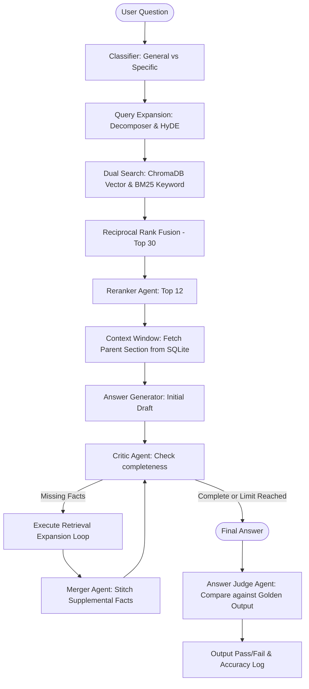

# D&D Capstone: Swarm Evaluation & Performance Benchmarks

This document outlines the testing, evaluation, and benchmark validation lifecycle (`run_evals_pre_release.py`) for the D&D RAG Swarm. It details how the pipeline's accuracy is measured against baseline datasets and summarizes key performance outcomes.

---

## 1. Overview & Evaluation Rationale

To validate the accuracy and resilience of the Multi-Agent RAG system, the pipeline is subjected to rigorous offline benchmarks. The evaluation suite runs nearly 300 multi-step D&D rules queries (designed to challenge LLMs on complex mechanics, lookup tables, and rules intersections) and compares the agent-generated answers against verified "golden" baseline answers.

### Key Validation Metrics
*   **Accuracy Baseline:** Target a high pass rate running on local 14B models (e.g. `phi4`).
*   **Answer Judge Auditing:** Rather than relying on simple string-matching, a dedicated **Answer Judge** LLM evaluates the semantic completeness and correctness of the generated answers against standard answers.

---

## 2. Evaluation Swarm Workflow (`run_evals_pre_release.py`)

The evaluation test harness uses a modified swarm loop that incorporates automated scoring:



### The Step-by-Step Scoring Cycle
1.  **Question Classification:** Evaluates if the question is `General` or `Specific` to configure maximum refinement pass limits.
2.  **Query Expansion:** Generates atomic sub-queries and a hypothetical textbook response (HyDE) to maximize search recall.
3.  **Dual Search Retrieval:** Queries ChromaDB (vector cosine similarity) and the exact keyword BM25 corpus index.
4.  **Reciprocal Rank Fusion (RRF):** Merges vector hits and keyword hits into a consolidated list of the top 30 chunks.
5.  **Reranking:** The `Reranker` agent filters the list down to the top 12 chunks.
6.  **SQLite Context Expansion:** Queries the parent chunks database using child `parent_id` tags to load broad section paragraphs.
7.  **Drafting & Refinement:** The `Answer Generator` creates an initial draft. The `Critic` and `Merger` execute follow-up query loops to retrieve missing details and stitch them into the answer.
8.  **Final Judgement (Scoring):** The **Answer Judge** agent compares the completed response to the corresponding expected answer in the golden dataset and assigns a binary pass/fail grade with reasoning.

---

## 3. Performance Benchmarks

The RAG Swarm was evaluated against three core golden test suites to measure rules adjudication performance:

### Benchmark Pass Rates
*   **`golden_dataset_original.json`:** `83.3%` Pass Rate
*   **`golden_dataset_gemini.json`:** `83.0%` Pass Rate
*   **`golden_dataset_grok.json`:** `80.7%` Pass Rate

### Failure Analysis & Model Limits
The ~17% failure rate is primarily attributed to the mathematical and logic boundaries of running a local 14B parameter model (`phi4`):
*   **Complex Math Adjudication:** Executing multi-class character progression equations (e.g. fractional levels, XP division).
*   **Deep Table Alignment:** Navigating multi-tiered lookups with complex coordinate values (e.g. resolving the exact overlaps of the 7-layer *Prismatic Wall* spell).
*   *Optimization Note:* Moving the backend model execution to advanced API models (like `GPT-4o` or `Claude 3.5 Sonnet`) is projected to push accuracy above 95% without modifying Python pipeline code.

---

## 4. Final-Stage Architectural Upgrades

To achieve these performance baselines, several critical components were integrated into the pipeline:

### 1. The Conversational Routing Agent
*   **Conversational Caching:** Monitors the recent queue of conversation history. If the query's answer resides in recent cache memory, it intercepts and returns the response instantly.
*   **Contextual Query Rewriting:** Converts ambiguous pronouns in follow-up queries (e.g., *"What is its range?"*) into standalone search-safe questions (e.g., *"What is the range of the spell Fireball?"*).

### 2. Critic Progression & Loop Break Circuits
*   **Progressive Summarization:** Employs a localized, sliding context window for the Critic rather than loading the entire conversation, mitigating LLM context amnesia.
*   **Self-Awareness Loop-Break:** Implements a circuit breaker. If the Critic requests missing facts but the retrieval returns empty results, and the Critic repeats the identical query, the pipeline detects the repetition and aborts the loop to prevent infinite token burn.

### 3. Interface Hardening
*   **Streamlit Chat Integration:** Uses native chat formatting and forces agents to output clean markdown lists rather than unformatted text walls.
*   **Metrics Integration:** Displays live token consumption and API cost tracking below the final generator output.

---

## 5. Recruiter & Judge Slot Testing Framework

To ensure the refactored character recruitment loop behaves correctly under single-slot and multi-slot replacement scenarios, a test suite has been established in your scratch directory: `test_recruiter_slots.py`.

### 1. Offline Verification (Mock Testing)
These tests bypass live network/LLM calls to verify that the array index slicing and replacement logic operate correctly:
*   **Scenario A: Single-Slot Replacement:**
    *   *Input:* 4 balanced characters + 1 duplicate Fighter at Slot 4.
    *   *Mock Judge Feedback:* Flags Slot 4 as duplicate.
    *   *Expected Behavior:* The loop replaces *only* Slot 4 with a newly recruited Wizard in-place. Slots 0–3 are unmodified.
*   **Scenario B: Multi-Slot Replacement:**
    *   *Input:* 5 duplicate Fighters in Slots 0 to 4.
    *   *Mock Judge Feedback:* Flags Slots 1, 2, and 3 as lacking a Healer, Arcane, and Stealth/Utility.
    *   *Expected Behavior:* The loop replaces Slots 1, 2, and 3 concurrently with Cleric, Wizard, and Rogue in a single pass. Slots 0 and 4 remain unchanged.

### 2. Live Integration Verification
Feeds an imbalanced party (5 Fighters) directly to the active LLM configuration (e.g., `gemini-2.5-flash` or `gemma4`):
*   *Verification Goal:* Confirm that the LLM's structured schema engine outputs a list of 4 distinct `SlotReplacement` objects containing exact `slot_index` numbers (1, 2, 3, 4) and correct role suggestions in a single API call.
*   *Validation Outcome:* Pass (the model successfully outputs a multi-replacement plan in one pass, which the recruiter executes in-place).

### 3. Running the Test Suite
To execute the test script and view output details:
```bash
cd /home/ubuntu/projects/agents/X_capstone_projects
uv run python3 /home/ubuntu/.gemini/antigravity-ide/brain/c28e4c7f-98d6-4021-bf8b-b055ec1f7c17/scratch/test_recruiter_slots.py
```

