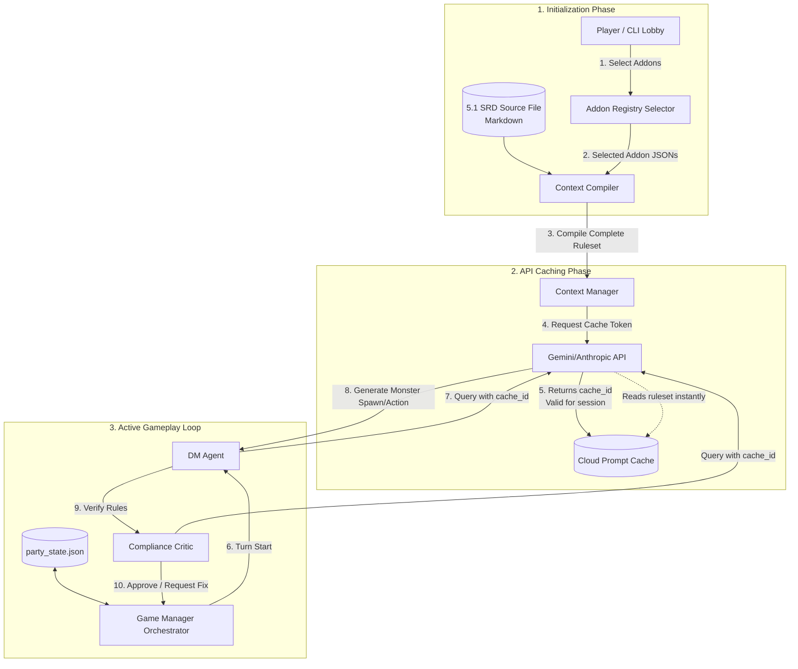
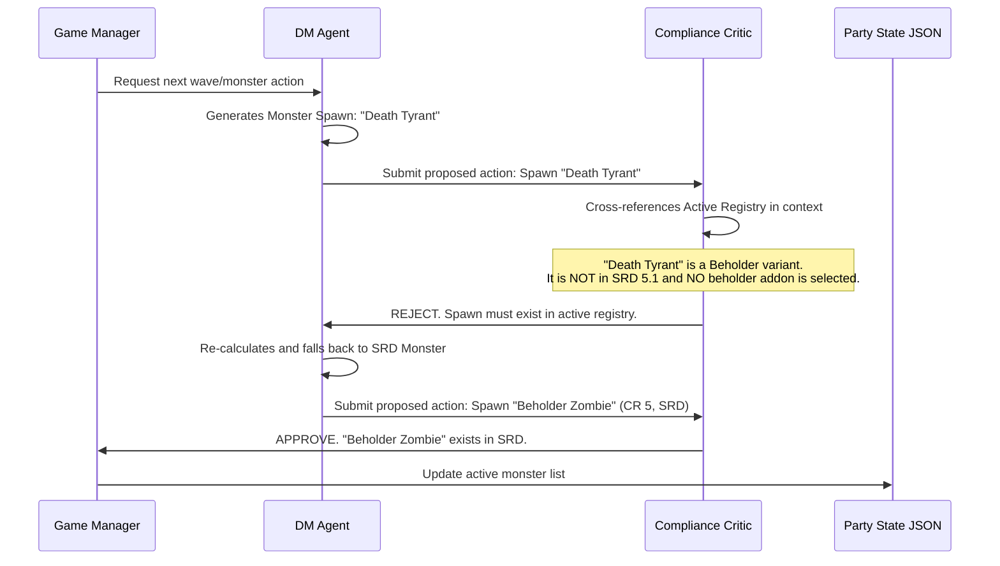

# No-RAG In-Context D&D Engine: Design & Architecture Document

This design document outlines the architecture for a RAG-less, fully in-context D&D agent system. Leveraging the massive context windows and prompt-caching capabilities of modern frontier LLMs (e.g., Google Gemini 1.5/2.5 Pro & Flash, Anthropic Claude 3.5), this architecture embeds the entire **D&D 5.1 System Reference Document (SRD)** and user-selected **community addons** directly into the model's active context.

---

## 1. Why No-RAG? (Motivation & Feasibility)

Traditional RAG (Retrieval-Augmented Generation) systems introduce several failure points in complex rule-based game engines:
*   **Grid and Table Blindness:** PDF table structures split into arbitrary chunks embed poorly. Finding the exact damage of a longbow requires retrieving the precise table row, which is easily missed by semantic vector searches.
*   **Cohesive Context Fragmentation:** Standard rules (e.g., conditions like *Restrained* or *Grappled*) must be synthesized with combat mechanics (Chapter 9). A RAG system only retrieves isolated fragments, leading to hallucinated rule interpretations.
*   **Latent Retrieval Failures:** If the vector database fails to retrieve a specific spell's text, the DM Agent is forced to guess or hallucinate spell slots, range, or saving throws.

### Feasibility of In-Context Ingestion
*   **SRD 5.1 Size:** The official D&D 5.1 SRD contains approximately 150,000 words. Converted to markdown/tokens, this translates to roughly **180k - 220k tokens**.
*   **LLM Context Capacities:** Google Gemini 1.5/2.5 Pro supports up to **2,000,000 tokens**. Gemini Flash supports **1,000,000 tokens**.
*   **Prompt Caching:** API providers now offer prompt/context caching. Once the core rules and addons are loaded and cached, subsequent turns only charge for processing the differential (the game state and last few turns of history). This yields:
    *   **90% Cost Reduction:** Cached tokens are billed at a fraction of the cost of standard input tokens.
    *   **80% Latency Reduction:** The model does not need to re-parse the ruleset on every single action.

---

## 2. System Architecture Overview

Instead of querying a ChromaDB vector store and SQLite DB on every action, the No-RAG engine compiles the ruleset and active addons once at the start of the session, registers them as a **Cached Prompt Context**, and routes all agent actions against this cache.



---

## 3. Addon Selection & Ingestion System

To allow players to dynamically choose community creations (monster packs, custom classes, custom spells), the engine uses a standardized **Addon Schema**.

### 3.1 Folder Structure
```text
/project-root
  /addons
    manifest.json
    /monsters
      kobold_press_beasts.json
      tome_of_horrors.json
    /spells
      community_spells.json
    /classes
      homebrew_classes.json
```

### 3.2 Addon Manifest (`manifest.json`)
The central registry tracking available packs, licensing, and file locations:
```json
{
  "available_addons": [
    {
      "id": "kp_tome_of_beasts",
      "name": "Tome of Beasts SRD (Selected)",
      "type": "monsters",
      "file_path": "monsters/kobold_press_beasts.json",
      "license": "Creative Commons Attribution 4.0",
      "description": "Adds 50+ CR-appropriate creatures from Kobold Press."
    },
    {
      "id": "community_homebrew_spells",
      "name": "Acrobat's Spell Pack",
      "type": "spells",
      "file_path": "spells/community_spells.json",
      "license": "Public Domain",
      "description": "Adds utility and movement-based spells."
    }
  ]
}
```

### 3.3 Addon Format Schema (Example: `monsters/kobold_press_beasts.json`)
Packs are stored as structured JSON. During compilation, they are rendered into standard markdown stat blocks:
```json
{
  "addon_id": "kp_tome_of_beasts",
  "monsters": [
    {
      "name": "Cave Fisher",
      "size": "Medium",
      "type": "monstrosity",
      "alignment": "unaligned",
      "armor_class": 16,
      "hit_points": 58,
      "speed": "20 ft., climb 20 ft.",
      "challenge_rating": 3,
      "abilities": {
        "strength": 16,
        "dexterity": 13,
        "constitution": 14,
        "intelligence": 3,
        "wisdom": 12,
        "charisma": 5
      },
      "senses": "darkvision 60 ft., passive Perception 11",
      "languages": "-",
      "traits": [
        {
          "name": "Spider Climb",
          "description": "The cave fisher can climb difficult surfaces, including upside down on ceilings."
        }
      ],
      "actions": [
        {
          "name": "Claw",
          "description": "Melee Weapon Attack: +5 to hit, reach 5 ft. Hit: 10 (2d6 + 3) slashing damage."
        }
      ]
    }
  ]
}
```

---

## 4. Context Window & Prompt Caching Strategy

To maximize performance, the system divides the LLM context window into a **Static Cached Prefix** and a **Dynamic Active Suffix**.

### 4.1 Context Payload Breakdown

| Section | Content | Estimated Size (Tokens) | Cache Status |
| :--- | :--- | :--- | :--- |
| **System Directives** | Core instructions, agent personas (DM, Player), output schemas | ~3,000 | **Cached** |
| **Core Ruleset** | Markdown version of 5.1 SRD (Classes, Combat, Spells, Items) | ~180,000 | **Cached** |
| **Selected Addons** | Text compiled from active community JSON monster and spell packs | ~20,000 - 50,000 | **Cached** |
| **Game State** | Current `party_state.json`, inventory, active spells | ~2,000 | *Active (Uncached)* |
| **Turn History** | Slide-window chat log representing the current combat round | ~8,000 | *Active (Uncached)* |
| **Current Prompt** | The active player or DM action query | ~500 | *Active (Uncached)* |

### 4.2 Gemini API Prompt Caching Implementation (Python snippet)
The following code demonstrates how the `ContextManager` uses Google Vertex AI/Gemini SDK to cache the compiled ruleset.

```python
import time
from google import genai
from google.genai import types

def create_ruleset_cache(client: genai.Client, compiled_ruleset_text: str) -> str:
    """
    Registers the compiled ruleset and returns a cache resource name.
    """
    # Create the cache
    cache = client.caches.create(
        model="gemini-2.5-flash",
        config=types.CreateCachedContentConfig(
            contents=[compiled_ruleset_text],
            # Rules are cached for 1 hour, refreshed on active interaction
            ttl="3600s", 
            display_name="dnd_5e_srd_with_addons"
        )
    )
    return cache.name

def query_agent_with_cache(client: genai.Client, cache_name: str, dynamic_prompt: str):
    """
    Executes a query using the cached context prefix.
    """
    response = client.models.generate_content(
        model="gemini-2.5-flash",
        contents=dynamic_prompt,
        config=types.GenerateContentConfig(
            # Apply the cached content prefix
            cached_content=cache_name,
            temperature=0.2,
            response_mime_type="application/json"
        )
    )
    return response.text
```

---

## 5. Rules Compliance Guardrails

A major user requirement is: *"whatever monsters you use or whatever rules you ingest must exist here."*

Without RAG, the DM could theoretically hallucinate monster names or custom spells that exist in standard D&D but were **not** in the selected community addons or the 5.1 SRD.

To prevent this, the engine enforces a **Two-Tier Compliance Guardrail**:

### 5.1 The Active Manifest Registry
Upon compiling the context, the system generates an in-memory **Active Registry** containing all available:
*   Spells
*   Monsters (Standard SRD + Addon packs)
*   Class archetype names

This registry is small (a few hundred text tokens) and is directly appended to the *Dynamic Game State*.

### 5.2 The Compliance Critic Agent
Every action proposed by the DM Agent (such as spawning monsters, calling a custom spell, or applying a rule) is parsed by a **Compliance Critic** before mutating `party_state.json`.



---

## 6. How to Build & Run: Step-by-Step

### Phase 1: Rules Pre-processing
1.  **Extract Markdown:** Run a script to convert the PDF 5.1 ruleset to a clean Markdown file (`srd_5.1.md`).
2.  **Addon Registration:** Place community json files in `/addons/monsters/` and `/addons/spells/`.

### Phase 2: Game Session Setup
1.  **Lobby Selection:** The user starts the game launcher and is prompted to select which addons to include.
    ```bash
    uv run python3 game_launcher.py --addons kp_tome_of_beasts,community_homebrew_spells
    ```
2.  **Compile & Cache:**
    *   The engine reads `srd_5.1.md`.
    *   It parses the selected JSON files and generates Markdown blocks (e.g. `### ADDON: Cave Fisher ...`).
    *   It bundles them together and uploads the string to the LLM's Prompt Cache.

### Phase 3: The Game Loop
1.  **Game Manager Orchestrator:** Loads `party_state.json`, determines turn order, and prompts the active character's agent or DM Agent.
2.  **Turn Processing:** Prompt includes current board state and turn history. Since the heavy rules are already cached, the turn processes in < 2 seconds.
3.  **State Mutation:** On successful validation, `party_state.json` updates and the game proceeds.
