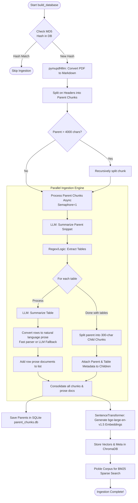

# D&D Capstone: RAG Encoding & Ingestion Lifecycle

This document explains the technical implementation of the ruleset ingestion and encoding engine (`build_rag_db.py`). It describes how raw, unstructured PDF text is transformed into hierarchical semantic retrieval layers optimized for LLM rule lookup.

---

## 1. Core Principles & Design Elements

Traditional RAG systems split PDF files into arbitrary, overlapping text blocks (e.g., every 500 characters). For highly complex, structured documents like D&D rulebooks, this approach fails because:
*   **Context Fragmentation:** A sentence explaining a wizard's spell slot limit loses its meaning if separated from the class progression header.
*   **Tabular Data Blindness:** Standard text splitters slice rows of tables in half. Furthermore, dense vector models embed grid characters (pipes `|` and hyphens `-`) poorly, making exact numeric lookups (e.g. Armor Class or Damage) highly inaccurate.

To address these challenges, this system uses a multi-layered **Hierarchical Chunking & Prose Conversion** strategy.

### Design Elements
1.  **Markdown Extraction:** Visual PDFs are converted to Markdown using `pymupdf4llm`. This preserves tables, headers, and bulleted lists in a parseable plaintext format.
2.  **Parent-Child Mapping (L1/L2 Hierarchy):**
    *   **Parent Chunks:** The markdown is split logically based on header tags (`#`, `##`, `###`). The maximum size of a parent block is capped at 4,000 characters.
    *   **Child Chunks:** The parent is subdivided into tiny, dense 300-character blocks with 50-character overlaps.
    *   Each child chunk is tagged in its metadata with its parent's ID, title, and overview. During retrieval, finding a child chunk allows the pipeline to load the parent's broader context (up to 1,500 characters) from SQLite.
3.  **Tabular-to-Prose Transformation:**
    *   All markdown tables (and poorly spaced "ghost" tables) are extracted.
    *   A programmatic parser extracts the table columns and converts each row into a natural language sentence (e.g., *"the weapon is Longsword, the cost is 15 gp, the damage is 1d8 slashing..."*).
    *   If programmatic parsing fails, a local `CoreAgent` performs the row-by-row conversion using a structured prompt.
    *   Each sentence is stored as an independent document in ChromaDB, mapped to the parent block's metadata.
4.  **Three-Way Storage Index:**
    *   **Vector Store (ChromaDB):** Stored as normalized cosine-distance vectors using the `BAAI/bge-large-en-v1.5` transformer model.
    *   **Relational Database (SQLite):** Relates parent IDs to their original paragraphs to facilitate wide-context enrichment during retrieval.
    *   **Sparse Index (BM25 Pickle):** Pickles the documents, metadata, and IDs into `bm25_corpus.pkl` to run lexical (keyword) queries.

---

## 2. Ingestion Lifecycle (The Pipeline)



---

## 3. Ingestion Pseudocode

Below is the pseudocode of the RAG builder demonstrating the hierarchical split and async table-conversion logic.

### Database Builder Loop

```python
async def build_database():
    # 1. Check if document has already been ingested using MD5 hash
    current_hash = calculate_md5(DOC_PATH)
    if chromadb_contains_hash(current_hash):
        print("Document already indexed. Skipping.")
        return

    # 2. SQLite Database initialization for parent paragraphs
    sqlite_conn = sqlite3.connect("parent_chunks.db")
    setup_sqlite_schema(sqlite_conn)

    # 3. PDF to Markdown Conversion
    markdown_content = pymupdf4llm.to_markdown(DOC_PATH)

    # 4. Logical Hierarchical Split (Header Splitter)
    header_splitter = MarkdownHeaderTextSplitter(
        headers_to_split_on=[("#", "Header 1"), ("##", "Header 2"), ("###", "Header 3")]
    )
    initial_parents = header_splitter.split_text(markdown_content)
    
    # Prune oversized parents to avoid exceeding context windows
    parent_chunks = []
    recursive_splitter = RecursiveCharacterTextSplitter(chunk_size=4000, chunk_overlap=300)
    for chunk in initial_parents:
        if len(chunk.text) > 4000:
            parent_chunks.extend(recursive_splitter.split_text(chunk.text))
        else:
            parent_chunks.append(chunk.text)

    # 5. Process parent chunks concurrently
    # The table_agent uses the local LLM config to convert and summarize tables
    table_agent = CoreAgent(agent_id="table_summarizer", system_prompt="Summarize D&D tables...")
    child_splitter = RecursiveCharacterTextSplitter(chunk_size=300, chunk_overlap=50)
    
    tasks = [
        process_parent_chunk_async(idx, text, current_hash, table_agent, child_splitter)
        for idx, text in enumerate(parent_chunks)
    ]
    
    all_documents, all_metadatas, all_ids = [], [], []
    
    for completed_task in asyncio.as_completed(tasks):
        p_id, p_text, child_docs, child_metas, child_ids = await completed_task
        
        # Save Parent chunk to SQLite DB
        sqlite_conn.execute("INSERT INTO parent_chunks (id, doc_hash, content) VALUES (?, ?, ?)", (p_id, current_hash, p_text))
        
        # Collect children & prose documents for embedding
        all_documents.extend(child_docs)
        all_metadatas.extend(child_metas)
        all_ids.extend(child_ids)
        
    sqlite_conn.commit()
    sqlite_conn.close()

    # 6. Dense Vector Embedding & ChromaDB Storage
    encoder = SentenceTransformer("BAAI/bge-large-en-v1.5")
    embeddings = encoder.encode(all_documents, normalize_embeddings=True)
    chroma_collection.upsert(ids=all_ids, embeddings=embeddings.tolist(), metadatas=all_metadatas, documents=all_documents)

    # 7. Pickle Corpus for BM25 Sparse Search
    save_bm25_pickle({"documents": all_documents, "metadatas": all_metadatas, "ids": all_ids})
```

### Async Parent-Chunk Processor

```python
async def process_parent_chunk_async(parent_idx, parent_text, doc_hash, table_agent, child_splitter):
    parent_id = f"{doc_hash}_parent_{parent_idx}"
    
    # Restrict concurrent LLM calls to prevent system overload
    async with Semaphore(1):
        # Generate parent summary/title
        parent_review = await summarize_content(table_agent, parent_text, mode="parent")
        parent_summary_str = f"{parent_review.title}: {parent_review.summary}"
        
        # Detect and extract tables using Markdown pipes or specific data patterns
        extracted_tables = detect_markdown_and_ghost_tables(parent_text)
        
        child_docs, child_metas, child_ids = [], [], []
        
        for table_idx, table in enumerate(extracted_tables):
            table_summary = (await summarize_content(table_agent, table, mode="table")).summary
            
            # Convert tabular columns to readable sentences
            prose_rows = await convert_table_to_prose_rows(table_agent, table)
            
            if prose_rows:
                for row_idx, prose in enumerate(prose_rows):
                    row_id = f"{parent_id}_table_{table_idx}_row_{row_idx}"
                    child_docs.append(prose)
                    child_ids.append(row_id)
                    child_metas.append({
                        "parent_id": parent_id,
                        "type": "table_row_prose",
                        "parent_summary": parent_summary_str,
                        "table_summary": table_summary,
                        "table_content": table
                    })
            else:
                # Fallback if no rows could be parsed: embed the summary
                table_id = f"{parent_id}_table_{table_idx}"
                child_docs.append(table_summary)
                child_ids.append(table_id)
                child_metas.append({
                    "parent_id": parent_id,
                    "type": "table",
                    "parent_summary": parent_summary_str,
                    "table_summary": table_summary,
                    "table_content": table
                })

    # Divide remaining text into small child chunks
    text_pieces = child_splitter.split_text(parent_text)
    for piece_idx, piece in enumerate(text_pieces):
        piece_id = f"{parent_id}_child_{piece_idx}"
        child_docs.append(piece)
        child_ids.append(piece_id)
        child_metas.append({
            "parent_id": parent_id,
            "type": "text",
            "parent_summary": parent_summary_str
        })
        
    return parent_id, parent_text, child_docs, child_metas, child_ids
```

### Tabular Data Translation Helper

```python
def parse_markdown_table_to_prose(table_text):
    lines = split_lines(table_text)
    if not is_markdown_table(lines):
        return [] # Fallback to LLM translation
        
    headers = extract_headers(lines[0])
    prose_rows = []
    
    for row in lines[2:]: # skip header and separator lines
        values = extract_values(row)
        # Pair column values with their respective header names
        row_pairs = [
            f"the {headers[i]} is {values[i]}" 
            for i in range(len(headers)) 
            if values[i] not in ["-", ""]
        ]
        
        if row_pairs:
            sentence = join(row_pairs) + "."
            prose_rows.append(sentence)
            
    return prose_rows
```

---

## 4. Evaluation: Strengths, Vulnerabilities & Solutions

### Strengths (Key Innovations)
*   **Grid Vector Mismatch Resolution:** Converting table rows into natural-language sentences (*"the weapon is Longsword, the damage is 1d8..."*) bypasses the poor alignment performance of dense vector embeddings on raw markdown pipe delimiters (`|`).
*   **Parent-Child Mapping (High Context):** Searching on dense, 300-character child chunks keeps the semantic search space optimized, while fetching the corresponding parent block from SQLite prior to prompt generation provides the model with complete paragraph-level context.
*   **Hybrid Search Foundation:** Integrating dense vector cosine lookup with a sparse exact keyword BM25 index guarantees that specific spells, monsters, and terminology are always resolved.
*   **Concurrency Guardrails:** Enforcing `asyncio.Semaphore(1)` on LLM processing prevents system thrashing when local models are run.

---

### Vulnerabilities & Potential Solutions

#### 1. Table Column Mismatch (Parser Alignment Errors)
*   **Vulnerability:** The programmatic row parser zips headers and cell values sequentially. If visual PDF extraction splits cells into multi-line strings or adds offset values, columns will align with incorrect headers (e.g. mapping Armor Class numbers to Weapon Damage headers).
*   **Potential Solution:** Implement a validation guard inside `parse_markdown_table_to_prose`. If the cell count of any data row does not equal the header column count, reject programmatic parsing and force the chunk to fall back to the structured `table_agent` LLM completion parser.

#### 2. Row Context Loss
*   **Vulnerability:** When a single table row is retrieved (e.g. *"the range is 150 feet"*), it might lose its surrounding context (e.g., that this is under the "Longbow" table section) if the parent chunk retrieved by SQLite has split boundaries that truncate section titles.
*   **Potential Solution:** Prepend the parent header / table summary string directly into each generated row sentence at ingestion time (e.g., *"For Martial Weapons: the weapon is Longsword, the damage is 1d8..."*).

#### 3. Ingestion Bottlenecks on Complex Tables
*   **Vulnerability:** Relying on single-threaded, semaphore-locked LLM queries to convert tables and generate parent summaries makes the initial ingestion cycle extremely slow when processing large files.
*   **Potential Solution:** Implement concurrent batching with a larger semaphore capacity (e.g. `Semaphore(4)`) if running on dedicated high-performance hardware, and store raw table texts in a temporary local JSON cache to bypass reprocessing during re-runs.

#### 4. BM25 Runtime Scoring Overhead
*   **Vulnerability:** Calculating BM25 scores dynamically against the entire unindexed text corpus (`bm25_corpus.pkl`) during a live query can block CPU execution for larger document libraries.
*   **Potential Solution:** Move the lexical lookup to a dedicated search index engine or pre-index the corpus structure during the build stage to speed up keyword query retrieval times.

---

## 5. Future Roadmap: Custom Monster & Community Addon Ingestion

To expand the gladiatorial arena's enemy pool beyond standard monsters, a pipeline must be designed to ingest custom, third-party, and homebrew creatures into the vector database, enabling players to select and toggle community rules expansions.

### 1. Ingestion Sources & Addon Packages
*   **Structured SRD APIs:** Connect to open-source portals like Open5e or 5e SRD to download standardized JSON monster files.
*   **Community Addon Packs:** Support importing open-license/Creative Commons rulesets (e.g. Kobold Press's *Tome of Beasts* SRD data or user homebrew JSON files).
*   **Local Homebrew files:** Maintain a local `/homebrew/` folder containing user-created JSON templates for custom monsters.

### 2. Processing & Prose Generation
Unlike standard prose rules, monster stat blocks consist of specific keys (Strength, Dexterity, Actions, Armor Class). To search and retrieve these accurately:
1.  **JSON Parser:** A custom script `ingest_custom_monsters.py` will read the monster's schema fields.
2.  **Structured Prose Assembly:** Construct semantic sentences for the embeddings:
    *   *Core Stats:* `"Creature [Name] has Armor Class [AC], Hit Points [HP], Speed [Speed] feet, and Challenge Rating [CR]."`
    *   *Attribute Block:* `"[Name]'s Strength is [STR] (+[Mod]), Dexterity is [DEX] (+[Mod])..."`
    *   *Action / Attacks Prose:* For each attack action, generate a descriptive sentence: `"Action: [Attack Name] has +[Bonus] to hit, range [Range], and deals [Damage] [Damage Type] damage."`

### 3. Vector Registration & Metadata Filtering
To allow players to toggle specific community packages on and off in their game settings lobby:
*   **Metadata Tagging:** Upsert each chunk into ChromaDB with an explicit `addon_pack` label (e.g. `addon_pack: "srd_5.1"` or `addon_pack: "tome_of_beasts"`).
*   **Runtime Filtering:** When queries are executed, the retrieval pipeline applies a ChromaDB metadata filter using the list of enabled lobby packs:
    ```python
    # Filter search by selected packages
    results = collection.query(
        query_embeddings=query_embeddings,
        where={"addon_pack": {"$in": ["srd_5.1", "tome_of_beasts"]}}
    )
    ```
    This ensures the DM Agent only retrieves and spawns creatures from authorized, selected community expansions.


