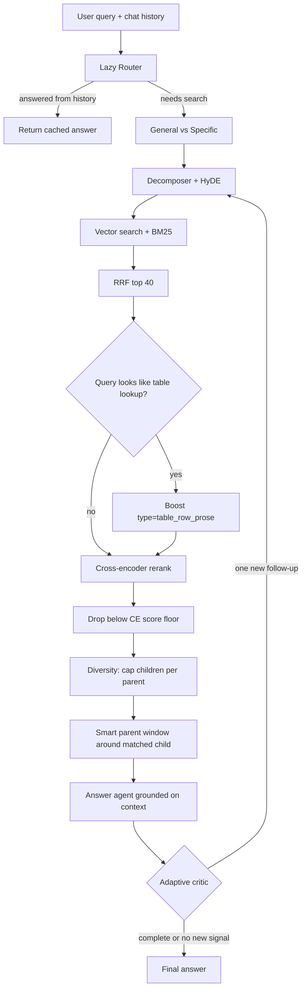
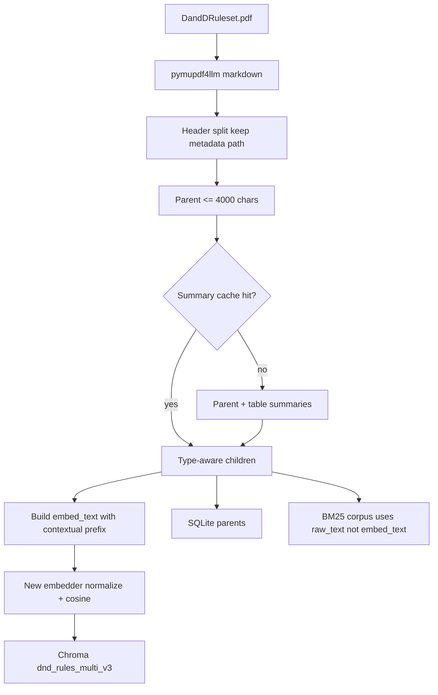

# D&D Capstone: RAG Upgrade Plan (Encoding → Retrieval → Agents)

This document is the implementation design for the next quality jump. It starts from the current system (`build_rag_db.py` + `core_rag_pipeline.py` + `core_agent.py`), absorbs the external review, and adds decisions that are specific to *this* codebase.

Related docs:
- Encoding as-built: `design/rag_encoding.md`
- Swarm as-built: `design/agent_architecture.md`
- Eval as-built: `design/evaluation_and_benchmarks.md`
- Hard-won incidents: `challenges_along_the_way.md`

This is a design, not a changelog. Do not start Phase 2 until Phase 1 is re-ingested and measured.

---

## 0. Verdict

The current system is already a real agentic RAG stack, not a demo:

- Hybrid search (Chroma cosine + BM25) fused with RRF
- Multi-query expansion (original + decomposer + HyDE)
- Parent-child hierarchy with SQLite parent expansion
- Table-to-prose conversion (the actual reason weapon/class-table lookups work)
- History router that can short-circuit
- Classifier-driven critic budget
- Corrective loop (critic → retrieve → merge)

The ceiling is no longer "add another agent." It is **what gets embedded**, **how candidates are ranked**, and **how many full swarm passes we burn on General questions**.

Do not add GraphRAG, more swarm roles, or hypothetical-question generation until Phases 1–2 land. Those only help if the vector store and ranker are already good.

---

## 1. Current Baseline (honest)

| Layer | What we ship today | Why it is a ceiling |
|---|---|---|
| Embedder | `BAAI/bge-large-en-v1.5` | Fine 2024 model. Weaker than current open embedders on instruction-style and long-prefix text. |
| Child text | Raw 300-char slice | The parent summary exists in metadata but is **not in the vector**. Retrieval cannot see section identity. |
| Header path | Computed by `MarkdownHeaderTextSplitter`, then discarded | `build_rag_db.py` keeps `doc.page_content` only. Easy win left on the table. |
| Table rows | Prose sentences, unprefixed | `"the cost is 15 gp"` without "Longsword / Martial Weapons" is still a weak vector. BM25 saves us; dense search does not. |
| Rerank | Full LLM over ~30 chunks every query | Works, but is the hottest latency/cost path after the critic loop. Also ranks "sounds relevant" not "contains the rule." |
| Parent expand | `row[0][:1500]` | First 1500 chars of a 4000-char parent is often the intro, not the matched subsection. |
| Metadata | `type`, `parent_id`, summaries | No header path, no page, no entities. Cannot filter or boost. |
| Critic | Up to 8 full retrieve+answer+merge passes on General | Already has a same-query circuit breaker. Still too willing to keep going. |
| Eval | Mostly answer-judge pass/fail | Cannot tell encoding wins from generation wins. |

What we will **not** regress:

- Table/ghost-table prose conversion. That was a 0% → ~100% MRR fix. Keep it.
- Strict "answer only from context / I don't know" grounding. The Relentless Rage incident stays closed.
- Hybrid + RRF as the candidate generator. Cross-encoders rerank; they do not replace recall.
- `one_shot=True` on ingest/query agents. Memory leaks during indexing are a solved incident.
- Collection versioning. New embedder = new collection. Never overwrite `dnd_rules_multi_v2` until v3 beats it on the golden set.

---

## 2. Design Principles

1. **Separate embed-text from retrieve-text.** Contextual prefixes belong in the vector. They must not pollute BM25 or the answer context window.
2. **Rank with a model built for ranking.** Use an LLM reranker only as a fallback on hard multi-hop leftovers.
3. **Do not threshold RRF scores.** RRF is an ordinal fusion (`1/(rank+60)`). Absolute cutoffs are meaningless across queries. Threshold the cross-encoder score instead.
4. **Child size is type-dependent.** 300-char children exist *because* we expand parents. Blindly moving everything to 800 chars plus full parent expansion wastes context.
5. **Measure retrieval before generation.** If the right parent never enters the top-12, the critic cannot invent it faithfully.
6. **Re-ingest is a one-way door.** Cache LLM summaries by content hash so embedder swaps do not re-summarize the book.

---

## 3. Target Architecture



Ingest side (v3 collection):



---

## 4. Phase 1 — Encoding foundation

**Goal:** raise recall quality so the existing swarm is searching better objects.  
**Files:** `DandDCapstone/build_rag_db.py`, new `DandDCapstone/ingest_cache.json`, collection name bump.  
**Must re-ingest.** Old vectors are incompatible.

### 4.1 Keep header path (free, do first)

`MarkdownHeaderTextSplitter` already returns header metadata. Today we throw it away:

```python
parent_chunks_text = [doc.page_content for doc in md_docs if doc.page_content.strip()]
```

Keep both:

```python
def header_path(md_doc) -> str:
    order = ["Header 1", "Header 2", "Header 3"]
    parts = [md_doc.metadata[k] for k in order if md_doc.metadata.get(k)]
    return " > ".join(parts)
```

Store `header_path` on every child and parent. Example: `Combat > Making an Attack > Advantage and Disadvantage`.

When an oversized parent is recursively split, propagate the same `header_path` and add `parent_part_index`.

### 4.2 Contextual embeddings (largest single win)

Embed a *prefixed* string. Store the *raw* string for BM25 and for the excerpt shown to the answer agent.

Text children:

```text
Section: {header_path}
Overview: {parent_summary}

{raw_child}
```

Table-row prose (this is where current dense search is weakest):

```text
Section: {header_path}
Table: {table_summary}
Overview: {parent_summary}

{prose_row}
```

Metadata contract (Chroma only accepts scalar values):

| key | example | purpose |
|---|---|---|
| `source` | `DandDRuleset.pdf` | provenance |
| `doc_hash` | md5 | skip/re-ingest |
| `parent_id` | `{hash}_parent_17` | SQLite join |
| `type` | `text` / `table_row_prose` / `table` | filter + boost |
| `header_path` | `Equipment > Weapons` | filter + display |
| `parent_summary` | `Martial Weapons: ...` | display + critic |
| `table_summary` | optional | table path |
| `raw_text` | unprefixed child/prose | BM25 + answer excerpt |
| `embed_text` | prefixed string | debug only; do not BM25 this |
| `child_char_start` | int offset into parent | smart parent window |
| `page` | int if pymupdf4llm provides it | citations later |

**Critical split:**

- Chroma `documents` field = `raw_text` (what the answer agent quotes)
- Chroma `embeddings` = `encode(embed_text)`
- BM25 corpus `documents` = `raw_text` **plus** `header_path` tokens only if we want lexical header hits. Do **not** dump the full parent summary into every sibling or BM25 collapses onto popular sections.

Recommended BM25 document:

```text
{header_path} {raw_text}
```

That gives "Advantage" and "Longsword" lexical signal without cloning the same 2-sentence overview 20 times.

### 4.3 Type-aware child size

Do not globally jump 300 → 900.

| type | size | overlap | reason |
|---|---|---|---|
| `text` | 800 chars (~180–220 tokens) | 120 | Enough local rule context; parent window still available |
| `table_row_prose` | 1 row, unchanged | n/a | Atomic fact; prefix supplies context |
| oversized parent split | 4000 / 300 | keep | unchanged |

Token-based splitting is nicer but not required for Phase 1. Character splitting is what the rest of the pipeline already assumes.

### 4.4 Embedder swap

Replace `BAAI/bge-large-en-v1.5`.

Decision rule (pick one after a 20-query smoke test, do not bikeshed):

1. Prefer a Qwen3-Embedding model that fits the same GPU budget as ingest (normalize + cosine, same as now).
2. Fallback: newest BGE/GTE that SentenceTransformers loads cleanly.
3. Reject any model that cannot embed the prefixed children in one ingest pass on this machine.

Implementation details:

- New collection name: `dnd_rules_multi_v3`.
- Keep `normalize_embeddings=True` and `hnsw:space: cosine`.
- `core_rag_pipeline.init_rag_system()` and every eval script must read a single constant, not a hardcoded string in four files.

Add to a small shared module (new file, see §8):

```python
COLLECTION_NAME = "dnd_rules_multi_v3"
EMBED_MODEL = os.getenv("RAG_EMBED_MODEL", "Qwen/Qwen3-Embedding-0.6B")
```

Start with the smallest Qwen3-Embedding that is still a quality upgrade. If VRAM during ingest is fine, move up a size. Query-time encoding in `core_rag_pipeline.py` currently forces `device="cpu"` — that should follow `RAG_DEVICE` the same way ingest does.

### 4.5 Ingest summary cache

Parent summaries and table summaries are LLM work. Embedder swaps must not redo them.

Cache key: `sha256(parent_text)` / `sha256(table_text)`.  
Cache value: `{title, summary}` or `{summary, prose_rows}`.  
File: `DandDCapstone/ingest_cache.json` (or sqlite table `ingest_cache`).

If `doc_hash` matches and collection v3 already has rows, skip entirely (existing behavior). If only the embedder changed, reuse cache and re-embed.

### 4.6 Table parser guard (from encoding doc, still open)

`parse_markdown_table_to_prose` zips headers to cells. If a row's cell count ≠ header count, **do not guess**. Fall back to the LLM prose converter. This is a one-condition fix and prevents silent column skew.

---

## 5. Phase 2 — Retrieval precision and cost

**Goal:** cheaper, more precise top-k after the vectors are better.  
**Files:** `DandDCapstone/core_rag_pipeline.py`, evals that reimplement search.

### 5.1 Cross-encoder rerank (replace default LLM rerank)

Pipeline after RRF:

1. Take RRF top **40** (up from 30; CE is cheap enough).
2. Score `(query, raw_text)` with a cross-encoder.
3. Keep top **12** above a score floor.
4. LLM rerank **only if** classifier said General *and* the CE top-1 vs top-12 gap is small (ambiguous set). Otherwise skip the LLM reranker entirely.

Suggested local CE: `BAAI/bge-reranker-v2-m3` or a current Jina reranker that loads on this box. Load once in `init_rag_system()`.

This is also how we escape the old "ugly duckling" CE penalty on raw tables: we now rerank **prose**, not pipe grids. That incident stays fixed.

### 5.2 Do not threshold RRF

If we want a floor, use the CE score. If fewer than 4 chunks survive the floor, relax it rather than returning an empty context. Empty context plus a grounded answer agent just yields "I don't know," which then sends the critic on a wild goose chase.

### 5.3 Diversity

After CE, cap **3 children per `parent_id`** in the top-12. This stops 8 near-duplicate 800-char slices of "Advantage" from crowding out the Grappled/Restrained sections on multi-hop questions.

### 5.4 Query-type metadata boost

We already classify Specific vs General. Add a cheap lexical hint, not another LLM:

```python
TABLE_HINTS = ("cost", "gp", "price", "damage", "hit die", "progression",
               "level ", "martial arts", "armor class", "ac ", "range")

def prefers_tables(query: str) -> bool:
    q = query.lower()
    return any(h in q for h in TABLE_HINTS)
```

When true, multiply CE scores for `type in {"table_row_prose", "table"}` by a small boost (~1.15) *or* guarantee at least 2 table rows survive diversity. Do not hard-filter; class-feature answers often need surrounding prose.

### 5.5 Smart parent expansion

Replace `row[0][:1500]`.

Given a winning child with `parent_id` and `child_char_start`:

1. Load full parent from SQLite (already stored).
2. Take a window: `[start - 400 : start + len(raw_text) + 800]`, snap to nearest newline.
3. Cap the window at ~1200 chars.
4. If the same parent wins multiple children, merge windows instead of repeating the parent.
5. Always prepend `header_path` + `parent_summary` as a one-line header.

Only skip expansion when the child is already a complete table-row sentence **and** the CE score is high. Table lookups do not need 1200 chars of surrounding equipment flavor.

### 5.6 Query embedder device

`init_rag_system()` hardcodes `device="cpu"`. After Phase 1 the embedder may be larger. Use the same `RAG_DEVICE` env as ingest, defaulting to CUDA when present. This is a one-line correctness/perf fix, not a feature.

---

## 6. Phase 3 — Adaptive critic (only after 1–2)

**Goal:** keep the corrective pattern, stop paying for empty passes.  
**File:** `core_rag_pipeline.py` (`answer_dnd_question`).

Current knobs: `MAX_PASSES_GENERAL = 8`, `MAX_PASSES_SPECIFIC = 3`, plus same-string follow-up abort.

New policy:

| signal | action |
|---|---|
| `is_complete` | stop (already) |
| empty `follow_up_query` | stop (already) |
| follow-up ≈ previous (normalize whitespace/case) | stop (already) |
| follow-up cosine/token-overlap > 0.9 vs any prior follow-up | stop (generalize the existing check) |
| last retrieve added 0 new `parent_id`s | stop |
| answer agent returned "I don't know" **and** CE top score was below floor | stop; surface "not in retrieved rules" instead of looping |
| Specific | default max **2** |
| General | default max **3** (was 8) |

Add `critic_confidence` only if we can do it without a schema fight. Prefer behavioral stops over another LLM field.

Answer-agent prompt addendum (one sentence, do not weaken grounding):

> If the context is thin or contradictory, say so explicitly and list which fact is missing. Do not fill gaps.

That gives the critic a real signal instead of a fluent-but-incomplete paragraph.

---

## 7. Phase 4 — Medium term (after measurement)

Only if Phase 1–3 eval says we still miss multi-hop / cross-ref questions.

1. **Hypothetical questions at ingest.** We already pay for a parent-summary LLM call. Ask for 2 short lookup questions per parent and embed those as extra docs of `type=hyde_question` pointing at the same `parent_id`. This is cheaper than live HyDE and may let us drop query-time HyDE for Specific questions.
2. **Closed-ontology entity tags.** Gazetteer + regex for classes, conditions, spells, weapons. Store as a comma-separated `entities` metadata string. Use for filters (`entities` contains `Grappled`) not for GraphRAG.
3. **Cross-reference edges.** Extract "see X" / "the Grappled condition" into a tiny sqlite `refs(src_parent, dst_name)`. At query time, if a retrieved parent refs a named condition that is not already in the set, pull that parent's summary. This is 80% of GraphRAG value on a single rulebook.
4. **Query-expansion cache.** Key = normalized question. Value = decomposer sub-queries + HyDE text. TTL unlimited for the golden set; optional for live chat.

Do **not** build a knowledge graph in Phase 1. The corpus is one book.

---

## 8. File-level change map

| file | change |
|---|---|
| `DandDCapstone/rag_config.py` **(new)** | `COLLECTION_NAME`, `EMBED_MODEL`, `RERANK_MODEL`, paths, child sizes, pass limits. Single source of truth. |
| `DandDCapstone/build_rag_db.py` | header path, contextual `embed_text`, type-aware split, table cell-count guard, summary cache, v3 collection, write `raw_text`. |
| `DandDCapstone/core_rag_pipeline.py` | load v3 + CE, BM25 on raw_text, diversity, table boost, smart parent window, adaptive critic, `RAG_DEVICE`. |
| `DandDCapstone/evals/run_evals.py` | stop hardcoding `bge-large` / collection name; add retrieval metrics. |
| `DandDCapstone/evals/debug_retrieval.py` | same search path as prod, or import from `core_rag_pipeline`. Do not keep a third copy of RRF. |
| `DandDCapstone/evals/run_evals_pre_release.py` | unchanged flow; it already imports the pipeline. Re-run as the generation judge. |
| `DandDCapstone/visualize_db.py` | point at v3 so plots stay meaningful. |
| `design/rag_encoding.md` | update after v3 ships (as-built, not this plan). |

Out of scope: `factory.py`, `recruiter.py`, `constants.py`, `app.py` (unless Streamlit needs a "retrieval debug" expander).

---

## 9. Evaluation protocol (gate every phase)

Do not judge an encoding change by reading one Fireball answer.

### 9.1 Fixed question slices

Reuse the golden sets, but tag a **20-item canary** that we run after every ingest:

| bucket | n | examples |
|---|---|---|
| Pure lookup | 5 | Longsword gold cost |
| Table-heavy | 5 | Monk Martial Arts die by level |
| Multi-hop / stack | 5 | Grappled **and** Restrained; Relentless Rage limits |
| Broad rules | 5 | How Advantage works in combat |

### 9.2 Metrics (retrieval first)

From `debug_retrieval.py` / a thin wrapper around `execute_full_retrieval_pipeline`:

- **Parent hit@12** — did the gold parent_id appear?
- **MRR of first gold child**
- **Table-row recall** on table-tagged questions
- **Unique parents in top-12** (diversity sanity)
- **p50/p95 latency** split: embed, BM25, CE, LLM-rerank (if used), answer, critic

Then generation:

- Existing Answer Judge pass/fail on the same 20, then full golden sets.
- Faithfulness: answer must not introduce mechanics absent from retrieved context (Relentless Rage regression test is mandatory).

### 9.3 Promotion rule

v3 replaces v2 only if:

- canary parent-hit@12 does not drop on any bucket, **and**
- table-heavy MRR stays at or above current (weapons / monk tables), **and**
- Specific-question p50 latency does not get worse (CE should make it better), **and**
- Relentless Rage still does not hallucinate.

If embedder upgrade helps general text but hurts table rows, keep table-row prose + boost; do not roll back prose conversion.

---

## 10. Suggested work order

1. Extract `rag_config.py` and point existing scripts at it. No behavior change.
2. Header path + contextual `embed_text` + `raw_text` split + table cell-count guard. Re-ingest as `dnd_rules_multi_v3` **with the current embedder**. Measure. This isolates "contextual retrieval" from "new model."
3. Swap embedder, re-embed using summary cache. Measure again.
4. Cross-encoder + diversity + smart parent window. Drop LLM rerank from the default Specific path.
5. Adaptive critic limits. Re-run pre-release evals.
6. Only then: hyde-at-ingest, entity tags, cross-ref table.

---

## 11. Risks and non-goals

**Risks**

- Prefixing every child with the same parent summary can make siblings collide in vector space. Mitigation: keep prefixes short; BM25 uses raw_text; diversity cap per parent.
- Larger children + parent windows can blow the answer context. Mitigation: 12 children, merged parent windows, 1200-char cap.
- CE on GPU + embedder on GPU + Ollama = VRAM fight. Mitigation: CE on CPU is acceptable; embedder follows `RAG_DEVICE`; keep `OLLAMA_NUM_PARALLEL=1`.
- Eval scripts that reimplement search will silently test the old path. Mitigation: one search function, imported.

**Non-goals for this upgrade**

- New swarm roles
- Graph database
- Changing the Streamlit UX
- Replacing BM25 with Elasticsearch
- Raising General answers to a 16k essay

---

## 12. Success picture

When this is done, a Specific table query should:

1. Hit the prefixed table-row vector **and** BM25 on the raw prose.
2. CE-rank the exact row into position 1–3.
3. Expand little or no parent.
4. Answer in one pass, no critic loop.

A multi-hop condition query should:

1. Retrieve children from *different* parents because of diversity.
2. Expand a tight window around each match, not the first 1500 chars of a 4000-char dump.
3. Critic at most once, and only if a named condition is missing.

That is the upgrade: better objects in the store, a real ranker, less swarm. Not more agents.
